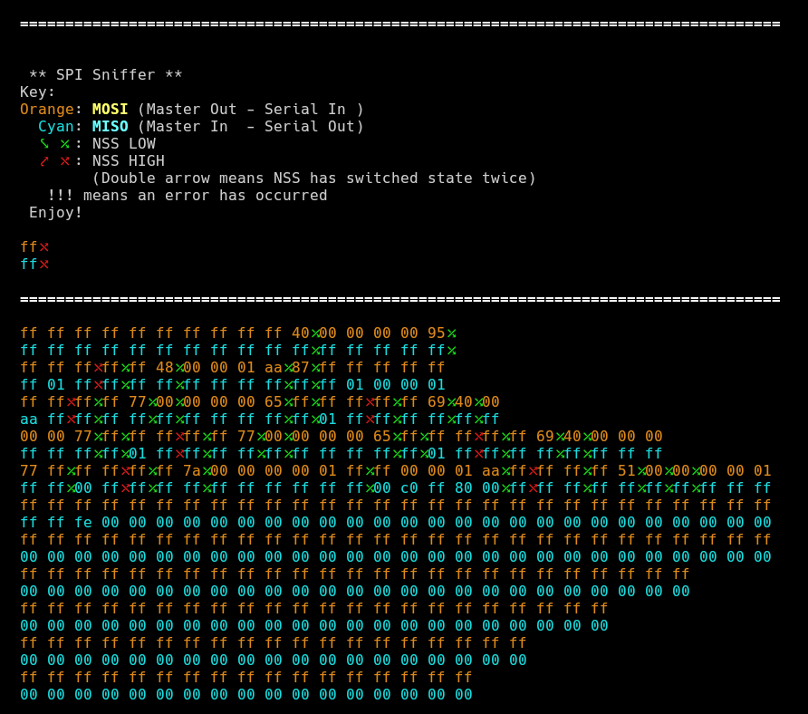

# SPI sniffer project
- **Board:** [NUCLEO-L432KC](https://www.st.com/content/st_com/en/products/evaluation-tools/product-evaluation-tools/mcu-eval-tools/stm32-mcu-eval-tools/stm32-mcu-nucleo/nucleo-l432kc.html), but should work on any STM32L4 board (and any STM32 with slight modifications)
- **Pins used:**
  - **PB4** (D12): SPI MISO
  - **PB5** (D11): SPI MOSI
  - **PB6** (D5): SPI CLK
  - **PB7** (D4): SPI NSS
- **Serial baud rate**: 2 000 000 bits/s
  
## Project Purpose
This project is built to connect to an SPI network and process any data sent through it in a transparent way.
It's useful for debugging SPI device issues.

## Important Notes
- **Set your SPI speed to a really low one**. Since a lot of data needs to be transferred via UART, decreasing the speed
of your SPI network makes sure that all bits are caught in time.
- This project currently supports SPI mode 0 (`CPOL=0`, `CPHA=0`).

## Details
- This project was built in STM32CubeMX for the Atollic TrueStudio IDE. If you load the project in STM32CubeMX, you can export
it to use any other IDE of your choice.
- This project sets the processor clock to 80 MHz, the highest one achievable, so that the SPI data can be processed
as fast as possible.
- The serial output contains colours. If your terminal doesn't support colours, you might see garbled characters.
- USART2 is used to output the data. The NUCLEO board will automatically send this data over USB. Alternatively,
you can connect an FTDI232 USB-to-Serial converter on pin PA2 to receive the data. Note that you have to use a converter
that supports a baud rate of 2 Mbits/sec.

  The command I used to open the terminal on linux was:
  ```bash
  minicom -c on -R utf-8 -b 2000000 -D /dev/ttyACM1
  ```
- The HAL driver is used, but all the necessary driver files are included in the *Drivers* folder.

## Important files
- **Src/main.c**: The source code of the project
- **spi-sniffer.ioc**: Open this file inside STM32CubeMX to edit the project.

## Screenshot
[](https://github.com/kongr45gpen/spi-sniffer/raw/master/screenshot.png)

